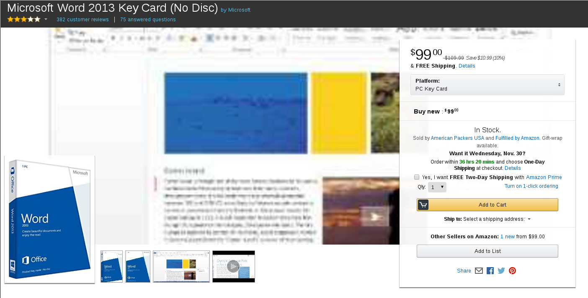
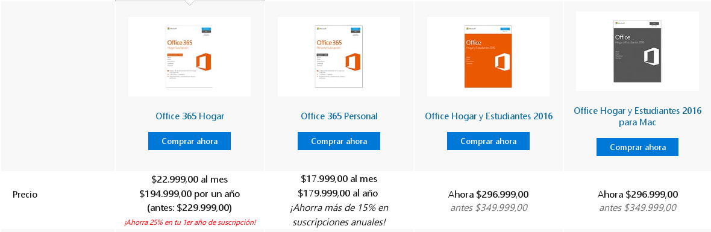
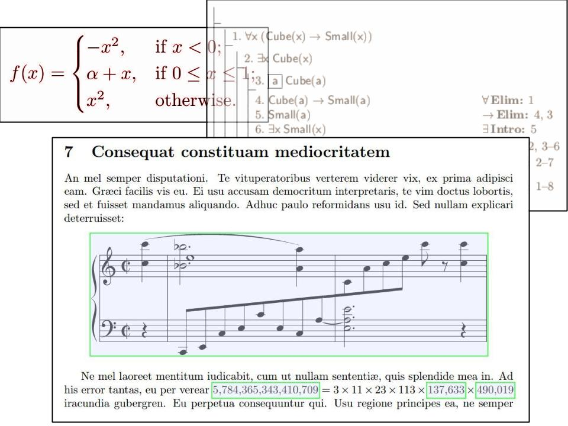
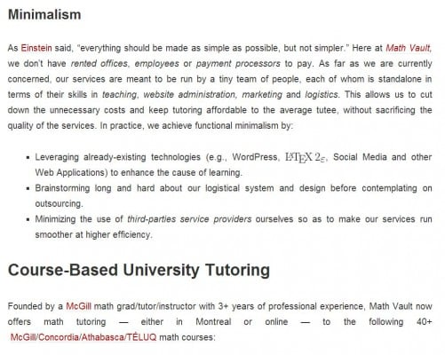
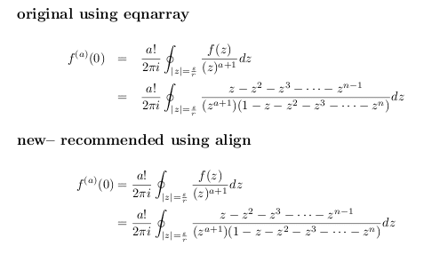
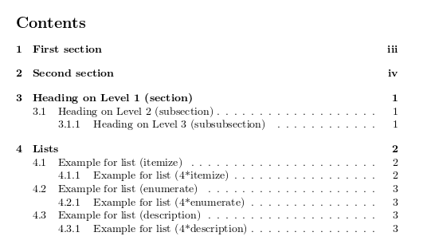
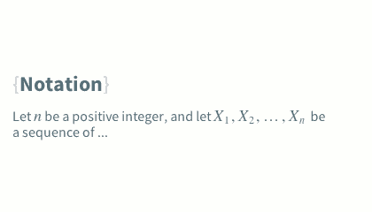
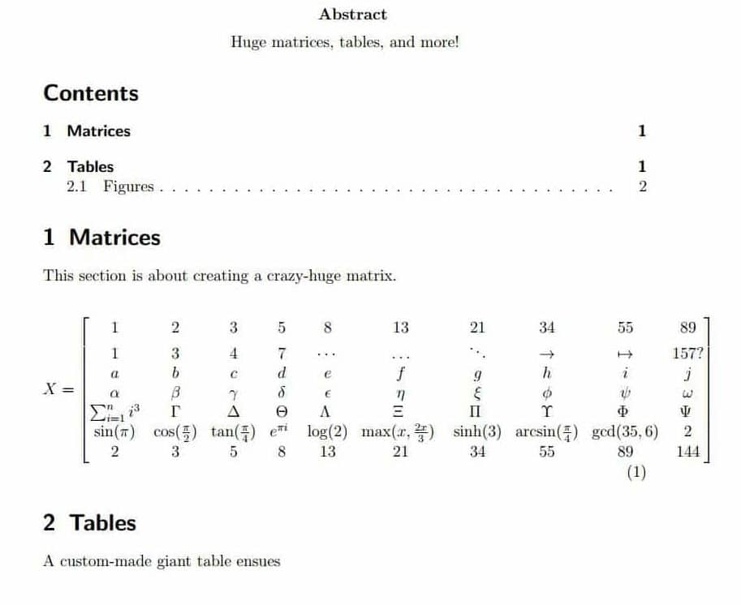

# Una introducción a LaTeX, Escritura Profesional y Publicación Científica (i.e. Evadiendo los tradicionales procesadores de Texto)

Para empezar es bueno tomarse un momento para pensar un poco en la base de lo que es LaTeX y qué significa como herramienta tecnológica; después de ver varios ejemplos de contextos en los que puede emplearse eficientemente LaTeX vamos a aprovehar [esta entrada de Math Vault][1] que nos presenta una introducción a LaTeX y algunas importantes razones para elegir LaTeX sobre los tradicionales procesadores de texto.

Versión original en inglés disponible en [MATH VAULT][1].

...

## Seis serias debilidades de los editores estándar WYSIWYG

¿Todos conocen un apliación de software llamada [Microsoft Word][2]? Seguramente que si y es probable que algunos de ustedes la hayan usado a lo largo de los años - o algún otro procesador de texto ["*lo que ves es lo que obtienes*"][3] (**WYSIWIG** - What You See Is What You Get) tal como [Libreoffice Writer][4], [Google Docs][5], etc.

Ahora, aunque le puedan resultar cuestiones desagradables, ¿qué pasaría si le dijera que se trata de pobres procesadores de texto, insatisfactoriamente diseñados con malformaciones filosóficas en mente, o que están principalmente construidos como editores de propósito general (i.e. no están pensados para publicaciones profesionales o a escala industrial)?

Con esto en mente, permítame compartir seis factores críticos de los que tienden a estar presentes en los editores WYSIWIG. Puede que algunos de estos defectos lo hayan afectado en algún momento, e incluso puede que usted sea conciente de alguno de ellos.

(Y para el equipo de investigación que [publicó en Diciembre de 2014 el estudio PLOS ONE][6] alabando la eficiancia de Microsoft Word como un editor de documentos para la academia, admitimos sentir cierta ambivalencia respecto de su sesgo Pro - Word, así como estar confundidos acerca de su afirmación del ahorro de tiempo y dinero al no tener que aprender a utilizar un sistema de preparación de documentos que podría proporcionarle beneficios de por vida.)

### Compatibilidad de Archivos

Esta es la cuestión: ¿Cómo hace usted para abrir un archivo doc/docx? Usualmente con *Microsoft Word!* (o alguna variante que acepte este tipo de archivos). En otras palabras, abrir un archivo de *Microsoft Word* requiere una *aplicación compatible con Microsoft Word*. Intente abrir estos archivos con un editor de texto básico tal como *NotePad* (o *TextEdit* en Mac o *GEdit* en GNU/Linux) y verá que sucede: un manojo de extraños e ilegibles símbolos que no tienen sentido.

Además de ser un texto poco amigable, convertir estos archivos a otros formatos, o incluso a una versión anterior del mismo formato - podría poner en peligro el formateo, alineación y otras especificaciones del documento. Esto puede requerir otra cantidad de cuidadosa corrección manual, lo cual puede ser algo realmente molesto. De hecho, existen muchos episodios recurrentes de los desastres de la conversión de archivos en la [historia de Microsoft Word][6] (en inglés).

### Propiedad y Costo

¿Cuánto cuesta una licencia de *Microsoft Word*? Una imágen vale más que mil palabras.

O si prefiere una suscripción a un plan de *Office 365*, la cual al parecer es más económica, vista superficialmente

Como poderosos procesadores de texto, la propiedad de las aplicaciones de preparación de documentos - aunque algunas veces sea justificable - puede obstaculizar la publicación del trabajo creativo, un derecho que hace décadas estaba reservado a las élites y asociaciones de la industria publicitaria.

Claro, existenes alternativas **Libres y de código abierto** al *Microsoft Word* tales como LibreOffice, [NeoOffice][8] o Google Docs. El problema - si existe alguno - es que éstos invariantemente sufren de las típicas debilidades exibidas por un procesador de texto WYSIWYG estándar, tales como poca *flexibilidad para extender sus características* y *un diseño de la interface gráfica poco satisfactorio.*

### Tipografía y alineación poco sofisticada

Mientras los editores WYSIWYG tradicionales proveen una enorme cantidad de opciones en términos de **fuentes, tamaños de fuente** y **colores**, los documentos producidos utilizando estos editores tienden a ser pobres en *elementos tipográficos* que hacen agradable, visualmente, su lectura. Por un lado, los textos construidos con estos editores por lo general están compuestos a **baja resolución**, usualmente con poco o ningún cuidado a las ornamentaciones minusiosas (e.g. [ligadura][9]) y los detalles de espaciamiento o alineación (e.g. [hifenación][10] - en inglés) comunmente observada en artículos y libros impresos producidos profesionalmente.

Ademas de la pobre tipografía, con los procesadores de texto tradicionales WYSIWYG, el final de las líneas es - la mayoría de las veces - pobremente alineado. Incluso si un párrafo esta completamente justificado, por lo general hay una carencia de consistencia en los espacios entre palabras - lo cual puede incurrir en que el documento luzca incluso más desordenado que el original. :(

Si lo que quiere es producir **fórmulas** y **equaciones** elaboradas, estará en serios problemas. Mientras los editores WYSIWYG estándar usualmente permiten insertar *símbolos exóticos* y a menudo ofrecen rudimentarias características para dibujar ecuaciones, puede - con toda probabilidad - encontrarse haciendo cientos de clics en un intricado ejercicio de coordinación mano - ojo, sin conseguir mayores resultados.

Precaución: Si intenta ejecutar muchas **ecuaciones, cuadros de texto** y **figuras** en el mismo documento de Word, puede estar en serio peligro de tener un [desbordamiento de memoria][11] (en inglés) que termine en la famosa [pantalla azul de la muerte][12] (**BSOD** por sus siglas en inglés) de *Microsoft*

### Características ineficientes de formato

Sin lugar a dudas estaremos de acuerdo en que *Microsoft Word* y sus competidores han evolucionado hasta alcanzar convertirse en *potentes editores de texto*. Por ejemplo, en la versión más reciente de *Microsoft Word*, los usuarios pueden determinar la posición de las imágenes simplemente **arrastrando y soltando**. Sin embargo, mientras que es un proceso aparente intuitivo, la posición de estas imágenes puede alterarse fácilmente durante el proceso de edición del documento, lo cual conlleva a que la posición de la imágen sea reajustada de nuevo una y otra vez.

"Ahh!!! ¿qué he hecho para merecer esto?"

Si por otro lado, intenta integrar algunos **cuadros de texto** dentro de los párrafos, problemas similares al formateo de imágenes volverán a aparecer: Llevaría su cuadro de texto a la posición deseada, pero este se arrastraría fuera de ésta llegando a [tierra de nadie.][13]. Otras veces, el editor puede ser más inteligente y simplemente desobedecer sus órdenes[^a].

### Numeración caótica

Si escribiera un libro hoy, ¿cómo enumeraría sus capítulos y secciones? simple, ¡contando!.

Muy bien, mientras ciertamente podría hacer una enumeración manual, (lo cual, hay que admitir es poco intuitivo) esto puede convertirse en una tarea muy difícil a medida que el número de capítulos y secciones se incrementa. Adicionalmente, ¿qué pasa si por accidente enumera el capítulo 13 como 12, o si decide introducir una nueva sección entre las secciones 5 y 6? bien, esto solo significa una cosa - que su numeración estará dañada y será necesario reajustar todo de nuevo.

Pero claro, el punto es que no solo se trata de enumerar capítulos y secciones, ya que la enumeración puede aplicarse a **referencias bibliográficas, tablas, figuras, definiciones** y **ecuaciones** (Si es que consigue hacerlo!).

Para ser justos, *Microsoft Word* soporta *configuraciones para enumerado automático* en alguno casos, pero a costo de mayor confusión y complejidad como [John McGhie de Microsoft Word MVP][15] lo indica (en inglés):

> "La numeración en Word es difícil porque Word intenta escondernos la "complejidad". En muchos casos, provee detalles insuficientes en la explicación de algunas características. Lamentablemente, una explicación simplista no ayuda a entender un tema complejo, por el contrario, llena nuestra cabeza de cosas incompletas lo cual hace al problema más difícil!"

Para empeorar el asunto, digamos que se refiere a la página 91 donde a hablado sobre la *[teoría económica keynesiana][16]*, pero después de editar el texto el mismo contenido se ha desplazado a la página 87. Pues bien, esto no es una buena noticia, porque significa que tendrá que cambiar su referencia de la página 91 a la 87!.

Y hay más: imagine el trabajo que es hacer referencias para **ecuaciones, secciones, capítulos, parágrafos, tablas, figuras, notas al pie** y **citas**, a través de cientos de páginas. No es precisamente una tarea para humanos, si lo considera.

### Gráficos dispersos / desordenados sobre calidad de imágen, velocidad y simplicidad

Mientras que los editores de texto WYSIWYG proveen una interfaz gráfica de usuario intuitiva, mostrando en pantalla, en *tiempo real*, como lucirá el documento cuando sea impreso, en ocaciones, también puede decirse que dan *demasiada* importancia a lo elaborado de los gráficos que sacrifican la **resolución en pantalla** y **calidad tipográfica**. Por ejemplo, Alain Cottrell, un fuerte defensor de $\TeX$ [lo dice de esta forma:][17]

> "El algorítmo tipográfico empleado por los procesadores de texto WYSIWYG sacrifica calidad a costa de la velocidad requerida para presentar resultados en tiempo real. El producto final es significativamente inferior que el conseguido con un verdadero programa tipográfico."

Adicionalmente, debido a la demanda de características y funciones más potentes que crece con los años, existe la tendencia - para los desarrolladores de editores de texto WYSIWYG tradicionales - de sacrificar la *claridad* de la interfaz de usuario (UI por sus siglas en inglés) debido a una excesiva cantidad de **iconos, menús, cajas** y **barras** - elementos amistosos - en la ventada principal del editor. Como resultado, los usuarios pueden encontrarse ejecutando repetidos click de mouse junto a una cantidad poco natural de fina coordinación mano - ojo, solo para conseguir alguna característica que puede ser más eficiente, energéticamente hablando, si se implementan algunas pulsaciones de teclado.

Para peor, La decisión de optar por más elementos gráficos - más que en una interfaz de usuario minimalista - eventualmente puede cobrar una cuota sobre la **velocidad** de los editores de texto en cuestion, agregando consumo de recursos de memoria y tarjeta gráfica así es como cada nueva versión tiene un proceso de instalación más largo y pesado.

## Introducción a $\LaTeX$ y sus fortalezas

Para quienes han utilizado todos estos años únicamente procesadores de texto como *Microsoft Word*, es un tanto difícil apreciar como una **interfaz gráfica de usuario** aparentemente intuitiva puede convertir el procesar texto, en una tarea realmente tediosa e ineficiente finalmente, es por esto que dirigimos nuestra atención a $\LaTeX$.

Entonces, ¿Qué es $\LaTeX$? bien, en [términos oficiales][18] (en inglés):

> "$\LaTeX$ es un sistema tipográfico de alta calidad que incluye características diseñadas para la producción de documentos técnicos y científicos. $\LaTeX$ es el estándar *[de facto][19]* para la comunicación y publicación de documentos científicos. $\LaTeX$ es [Software Libre][20]."

Este es el Logo oficial para $\LaTeX3$, que aún no esta disponible a pesar de un periodo de incubación de más de 20 años.

Basado en el trabajo sobre $\TeX$ del *mago de la ciencia computacional* [Donald Knuth][21], **$\LaTeX$** (donde X debe pronunciarse como C) fue desarrollado por primera vez en 1985 (!) por el matemático aficionado [Leslie Lamport][22] antes de volverse popular en la *comunidad científica* y de *tipografía*. Desde 1994, $\LaTeX2\epsilon$ ha sido la versión actual de $\LaTeX$, a pesar de que el proyecto $\LaTeX3$ ya estaba en marcha a principios de los 90's.

Y... antes de explorar las potentes funcionalidades de $\LaTeX$, por qué no hacer una rápida revisión a sus "[Preguntas visuales (en inglés)][23]" y así pueda usted mismo juzgar lo que $\LaTeX$ puede ayudarle a lograr.

### Tipografiado profesional de clase mundial

En $\LaTeX$ las fuentes son tipografiadas en *alta resolución* y tan *intrincadamente diseñadas* que una vez que usted es conciente de ello es casi imposible (incluso vergonzoso) recordar su anterior *falta de estética textual*.

Además, si su artículo tiene algún contenido matemático, ¿cómo hace para mecanografiar todas esos complicados símbolos (e.g. **fracciones, letras griegas, matrices**) sin tener alguna clase de *herramienta especializada*? y mientras esto es algo ciertamente posible de hacer con *Microsoft Word*, aún queda el ineficaz cliqueo de iconos - como mínimo.

No solo se trata de hermosas letras. Ecucaciones, demostraciones formales e incluso música!!!

Definitivamente, *hay mucho más de lo que los ojos ven* (literalmente). Para comprender más la comparación de las diferencias tipográficas entre *Microsoft Word* y $\LaTeX$ - en imágenes - revise [La belleza de $\LaTeX$ de Dario Taraborelli's.][24]

### Justificación completa / Alineación correcta

¿Alguna vez a notado qué tan desorganizadas lucen las **páginas web** con la alineación usual (izquierda) - o incluso en algunos *libros*? Por defecto, los documentos preparados usando $\LaTeX$ usan *justificación completa*. y mientras que la justificación completa es conocida por ser [poco optima en páginas web][25], el mismo hecho es prácticamente inexistente en $\LaTeX$, donde la justificación se obtiene a través del uso *inteligente* de **hifenación** - y no a través de la modificación del espacio entre palabras como sucede en las páginas web.

A pesar de nuestro mejor esfuerzo para dejar los párrafos completamente ajustados, tenemos que admitir que WordPress definitivamente no es un sistema de tipografiado profesional después de todo - solo hace falta ver cómo luce el último párrafo.

En serio, hablando de alineación, ¿alguna vez te has encontrado pulsando varias veces la barra espaciadora para conseguir una alineación visualmente correcta, solo para que unos pocos segundos después todo se encuentre desordenado nuevamente?

No. No se ha utilizado la tecla `Espacio` - son solo dos columnas invisibles en el fondo. ;-)

Pues bien, solo tendremos que decir que en muchos casos esto puede considerarse un enfoque muy incómo para la **alineación** y **formato**. En $\LaTeX$, por ejemplo, el sistema esta deliberadamente configurado para ignorar la escritura de Espacios / Enter, lo cual significa que a medida que los usuarios incrementan su desempeño con $\LaTeX$ también se ven obligados a utilizar **comandos, columnas invisibles** o **separadores** - contrario a algunos de los otros *aparentemente trucos intuitivos* que pueden hacer del formateo una tarea difícil y demorada.

### Numeración Automática

Imagínese escribir un *reporte de desempeño semanal* con 15 secciones numeradas, y en su objetivo de completar el reporte, olvida - en medio de la confusión y el caos - incluir la sección *Medidas y Gráficas*, la cual debería aparece entre las secciones 4 y 5 de su reporte.

¿Qué hacer? bien, esto significa que su numeración esta - oficialmente - hecha un desastre, y tiene que volver a construirla de nuevo!.

Por otro lado, si esta usted usando $\LaTeX$, este tipo de problemas nunca habrían aparecido en su camino. En otras palabras, hablando de **secciones, subsecciones, capítulos, notas al pie, referencias bibliográficas, teoremas, ecuaciones** o **figuras**, $\LaTeX$ hace la tediosa numeración manual una cosa del pasado. ¿Por qué?, porque el *proceso de compilación* se encarga de esta tarea por usted.

Escriba los títulos de las secciones y obtenga la numeración gratis! Mejor que MacDonald.

Y si quisiera referirse de nuevo a cualquier **objeto** (e.g. **referencias, ecuaciones**) mencionadas en las páginas anteriores, no necesita escribir el número de referencia manualmente gracias al sistema de [referencias cruzadas][26] (en inglés), $\LaTeX$ esta especialmente diseñado para *reajustar automáticamente la numeración* cada vez que se modifica el documento, así es que *por el amor de Dios*, utiliza $\LaTeX$, hazlo por ti.

Fíjese que la palabra sección esta determinada por la clave "sec:word", lo cual le permite referirse más adelante a esta sección. Como resultado, no hace falta numeración manual en el proceso de refenciado.

### Separación de contenido y diseño

Pregunte a un usuario *regular* de $\LaTeX$ hacerca de ¿qué es lo mejor de $\LaTeX$?, y problablemente se encontrará con una respuesta como esta

> "La mayor diferencia entre un editor **WYSIWYG** tradicional y **$\LaTeX$**, esta en que $\LaTeX$ ha sido diseñado específicamente para [separar el contenido del diseño][27] (en inglés) - todo a la vez."

Mientras que es normal elogiar a los editores WYSIWYG tradicionales por su **intuitiva interface de usuario**, a los ojos de un defensor de $\LaTeX$, la posibilidad de modificar *fácilmente* el **diseño / presentación** de un documento - sobre la marcha - representa una de las *principales debilidades en un sistema de preparación de documentos*, debido a que esto puede convertirse en un *repetitivo, ajuste intermitente de los **detalles de formateado** * para el usuario - usualmente no entrenado como diseñador - *mientras trabaja en su documento.*

En el otro extremo del espectro, el sistema de $\LaTeX$ esta configurado para que con mayor probabilidad, el **diseño** y otras **especificaciones de formato** se encuentran exclusivamente en el **preámbulo** (i.e. al inicio del código fuente) y las **hojas de estilo**. Esto puede tener el efecto de *condicionar al usuario* a especificar los **componentes de diseño** una sola vez para todo el documento, y luego proceder a enfocarse en la creación del contenido - sin tener que preocuparse de cambiar el **tamaño del texto, elegir la fuente, color** o **identación de los párrafor** en el documento.

### Características Extendidas

Si quiere una nueva **característica**, o un nuevo **atajo** a una opción que usa con regularidad, en *Microsoft Word*, ¿qué debe hacer?. En mucho casos, esto no tiene una fácil solución, y en otros casos, simplemente no existe solución dentro del *propio sistema*.

En contraste, un usuario regular de $\LaTeX$ no trabaja exactamente sobre el documento propiamente dicho - sino sobre su **código fuente**, el cual inherentemente provee completa *capacidad de codificación* y estáncias para que sus usuarios *invoquen* y hagan mucho mas que lo que *cualquier conjunto estandar de funcionalidades pudieran ofrecerle.* Esto es, a diferencia de la mayoría de procesadores de texto WYSIWYG tradicionales, $\LaTeX$ no luce como un sistema el cual solo ofrece la **ilusión de abundantes características**. Por el contrario, provee al usuario con la *potencia de la codificación y la libertad para hacer uso de ésta tal y como lo prefiera.*

Por ejemplo, una forma de obtener una característica extendida en $\LaTeX$ es a través de la creación de nuevos $ambientes$ y $comandos$ - lo cual, esencialmente sirve para *reducir un bloque de código a una o dos líneas*. Después de crear estos *atajos*, puede proceder  a usarlos *tantas veces como sean necesarios* - o igualmente, crear *características más complejas* basadas en los ambientes / comandos ya creados.

Note como el ambiente "king" fue creado y utilizado para mostrar la hermosa caja de la derecha!

En realidad, si algún día se vuelve *brutalmente sofisticado* para codificar, podrá entonces crear sus propias *plantillas de documentos* y *hojas de estilo* - las cuales puede obviamente incluir algunos nuevos ambientes y comandos de su propia cosecha! y una vez la creación esté completada, estará en todo su derecho de reservar estos tesoros solo para usted, o publicarlos en línea en algún **repositorio centralizado** (e.g. [CTAN][28]) - para que todos puedan verlos y utilizarlos!, de hecho, este es el espíritu del **código abierto, no privativo** de  $\LaTeX$ desde los primeros días, lo que significa que cualquier posibilidad de expandir sus características esta limitada *únicamente por los límites de su propia imaginación!* (aparte de las limitacion técnicas propias de $\LaTeX$ por supuesto.)

Veamos... Dibujos, ecuaciones químicas, diagramas de árbol, circuitos, expresiones matemáticas y tableros de ajedréz.

## Típicas desventajas de $\LaTeX$

Tan espléndido como popular puede ser $\LaTeX$ (a lo menos en la comunidad científica!), obviamente no faltan defectos e inconvenientes. En lo que sigue, trataremos algunos de éstos para el enfado de alguno y la consternación de otros! :-)

### Instalación y mantenimiento de las distribuciones de $\LaTeX$

Tradicionalmente, $\LaTeX$ es usado *offline* mediante la instalación de una [distribución de $\TeX$][29] (en inglés), acompañada de un **editor de $\LaTeX$** para poder editar el **código fuente**. Existen muchas distribucioes de $\TeX$ disponibles libremente en la Web, *algunas estandar* son [MiKTeX][30] (para *Windows*), [MacTeX][31] (para *Mac*) y [TeXLive][32] (multiplataforma).

Dependiendo de su nivel de habilidad con computadoras, *instalar una distribución $\TeX$ y agregar/actualizar las fuentes tipigráficas y paquetes* puede ser pan comido - o un completo incordio. El tamaño de las distribuciones también puede variar, una instalación básica tiene en promedio 150 MB (e.g., [Basic MiKTeX][33]), y una completa 2.5GB en promedio (e.g., MacTeX 2015).

### Aprendiendo el lenguaje #\LaTeX#

Si ha llegado hasta aquí, a través de todas estas secciones, tal vez se haya percatado de que a diferencia de los editores tales como *Microsoft Word*, los usuarios de $\LaTeX$ realmente no editan un documento *escribiendo* exactamente los mismos símbolos que quieren ver en el documento. Por el contrario, ellos editan el **código fuente** del documento, en **$\LaTeX$** - que es, un **lenguaje de computación etiquetado** tal como HTML para páginas Web.

De nuevo, dependiento de su experiencia codificando, aprender el [lenguaje $\LaTeX$][35] (en inglés) puede ser una tarea de algunos días, o algunas semanas/meses. Admitamoslo, esto es un pequeño precio a pagar por usar *editores tradicionales de $\LaTeX$*, ya que no dispondrá de pequeños **botones/menús** para dar click o activar. Sin embargo, si usted persiste lo suficiente, su red neuronal crecerá densa y la recompensa superará con creces la inversión inicial. Realmente ¿por qué no pensar de esta forma?. ;-)

> "En la vida, lo que inicialmente es difícil suele convertirse en fácil, y lo que inicia siendo fácil termina por convertirse en difícil."

### Caótico código fuente

Mientras que en algunas instancias, implementar caracteríticas mediante la escritura de código directamente puede ser, ciertamente, más rápido que estar danto click sobre **iconos, menús** y **ventanas**, también no es ninguna sorpresa que el código de computación tiene una notoria reputación de ser poco amigable - especialmente cuando hay presentes grandes bloques de toda clase de **símbolos no alfabéticos** (e.g., **backslashes, paréntesis, llaves y corchetes**).

De hecho, es posible decir que es algo muy común que los usuarios frecuentes de editores $\LaTeX$ experimentan regularmente, debido a que trabajan con **fórmulas complejas, tablas, diagramas** y **figuras**. Para hacerse a una idea observe en la siguiente imágen el código y la fórmula resultante:

¿Puede ver ese texto deforme resaltado en el medio del plano izquierdo? Eso es el código fuente utilizado para escribir la ecuación que se observa en el plano de la  derecha. En este caso, debido a que la ecuación es *relativamente sencilla*, solo hicieron falta unos pocos intentos de codificación - antes de poder obtener la fórmula tal y como queríamos que se viera. Ahora, imagine hacer un diagrama esquemático de una **red compleja**, con varios **sub-componentes, conectores** y **flechas curvadas**... ¿Cuánto más trabajo debe costar?

Y la verdad es... la creación de objetos complejos através del uso *exclusivo* de código fuente puede ser una tarea mucho más incómoda y abrumadora humanamente hablando, debido a que nuestros ojos y cerebro no han evolucionado adaptativamente para analizar eficazmente símbolos que se ven extraños. Y aunque es algo difícil de admitir para los fanáticos del código fuente, hay algunas instancias donde implementar algura características es más eficiente - no *códificando* o *simplemente desarrollando algún nuevo ambiente/comando* - sino *modificando directamente la previsualización misma del documento*.

Esto, obviamente, es donde los usuarios de editores gráficos WYSIWYG se lucen - y donde fallan las interfaces basadas en código fuente. De hecho, el matemático y defensor de $\LaTeX$ Jim Hefferon [dice][36]

> "El extremo opuesto, un documento tal como un folleto a un anuncio donde imperan los gráficos, cambios de fuentes, y color, se construye mejor con una herramienta de diseño como Quark o Framemaker."

## $\LaTeX$ en el siglo 21
Dependiendo de su experiencia **codificando** y en **tipografía**, su opinión sobre la utilidad de $\LaTeX$ puede variar. Por ejemplo, sabemos que para algunos usuarios regulares de $\LaTeX$ el placer esta en no tener que lidiar con problemas técnicos, mientras que algunos otros se quejarían de la irrelevante e intimidante interfaz de los tradicionales editores $\LaTeX$. [Math Vault][37] cree que la solución es sacar lo mejor de ambos mundos, aquí están sus recomendaciones acerca de algunos editores $\LaTeX$ muy vanguardistas.

### OverLeaf -  Paquete inicial
OverLeaf (Anteriormente conocido como _WriteLaTeX_), es un editor $\LaTeX$ en línea **basado en la nube** que permite preparar documentos sin el problema de la instalación y mantenimiento de las distribuciones $\LaTeX$ (como fuentes y paquetes que pueden ser añadidos sin límites de tamaño). Esto sólo es posible porque la **gestión de código fuente, la composición tipográfica, la compilación** y **vista previa de PDF** son procesadas en la nube. Todo lo que realmente necesita hacer es crear una cuenta, y está listo para comenzar. Entonces usted puede elegir trabajar en sus propios documentos y publicarlos, ó compartirlos y colaborar con otros autores en tiempo real.

En el modo texto enriquecido de OverLeaf, las secciones y fórmulas se renderizan en tiempo real, haciendo a esta interface más intuitiva y menos intimidante para los usuarios.

Sin embargo, lo que realmente brilla en OverLeaf es su (Limitado) **modo de texto enriquecido**, que permite **vistas previas** y expresiones matemáticas, en el mismo lugar, teniendo en cuenta que se trabaja a través de código fuente. Esto claramente es un gran beneficio, ya que los usuarios ya no tienen que infiltrarse a través de complicados códigos fuente de tediosas y largas expresiones matemáticas para saber que representan. Además la interfaz más amigable y el modo "texto enriquecido" también mantiene la tradición de una **edición de documentos basados en código fuente**, que como ya debería saberlo, minimiza la necesidad de introducir nuevos botones cada vez que hay una nueva funcionalidad. ¿El resultado? Una interfaz de usuario más limpia y eficiente, junto con una curva de aprendizaje más plana.

Sin embargo, como una aplicación web tipo Freemium (en rápido desarrollo) monetizada a través de la oferta de almacenamiento adicional/ancho de banda y características avanzadas, OverLeaf por supuesto no carece de inconvenientes y limitaciones. A continuación se presentan algunas de esas debilidades:

1. __Velocidad:__ Mientras que un usuario de la versión gratuita de Overleaf tiene acceso a una completa distribución de $\LaTeX$ sin tener que instalarla en su computador, el acto de la composición tipográfica en nube puede tener un costo en la velocidad de la aplicación y la fluidez con la que ésta se ejecuta. En OverLeaf, la vista previa se actualiza casi tan pronto como se termine de realizar una edición en el código fuente. Como resultado, la pantalla de previsualización puede retrasarse un poco de vez en cuando.
2. __Límite de almacenamiento:__ Un usuario de la versión gratuita de Overleaf tiene un tamaño inicial de almacenamiento de 200MB, y mientras aumenta el tamaño de almacenamiento a 1GB a través de referencias y ayudas, lo más probable es que el usuario termine pagando las suscripciones, si necesita una expansión más importante en el espacio de almacenamiento.
3. __Características Limitadas:__ Desde que usted decidió externalizar la instalación y mantenimiento de una distribución $\LaTeX$ a Overleaf, no debería sorprenderle que ellos esperen a que usted pague un poco por las características estándar que comúnmente están disponibles en los editores $\LaTeX$ offline. Son características tales como historial del proyecto, seguimiento y comparación de versiones, y archivos ilimitados por proyecto.

¿Cambiarse a OverLeaf? Si usted quiere preparar un documento largo, como un informe de 100 páginas o un libro, OverLeaf, o al menos su versión gratuita, probablemente no es un candidato ideal para la tarea. De hecho, no es raro encontrar miembros de la comunidad $\LaTeX$ que están estupefactos sobre la necesidad e importancia de una aplicación web, ya que muchas de las características premium en Overleaf pueden obtenerse gratuitamente a través de sus contrapartes offline con un poco de trabajo adicional.

###BaKoMa Tex - ¿El último editor $\LaTeX$?
Como una aplicación web en la nube, OverLeaf parece ser lo suficientemente sofisticado para tratar con menor seguridad y cuestiones administrativas generalmente asociadas con el almacenamiento en línea. Sin embargo, para aquellos que mejor almacenarían sus códigos fuente en su propio computador y se benefician de las características completas que no están disponibles para los usuarios de versiones gratuitas de editores $\LaTeX$ en línea, hay solo una alternativa offline que ayuda a solucionar esos problemas, superando generalmente a la mayoría de sus contrapartes ya sean en línea o no.

¿El nombre? BaKoMa Tex. Tan raro como podría sonar (son las iniciales de su creador _Basil K. Malyshev_), BaKoMa Tex es la navaja suiza de los editores $\LaTeX$. ¿Por Qué? Bueno, simplemente porque permite editar tanto el código fuente como la vista previa del documento con sincronización simultanea entre las dos interfaces en tiempo real.

Y tan inocente como parece, estas características pueden tener profundas repercusiones en la facilidad de uso del programa y potencial de productividad. En primer lugar, en vez de modificar las figuras o tablas pellizcando el código fuente, se puede lograr la misma tarea a una velocidad mucho más rápida modificando directamente la vista previa de las figuras y tablas en su lugar. En segundo lugar, porque la vista previa de un documento está disponible instantáneamente justo después de hacer cualquier cambio en el código fuente, esto reduce dramáticamente el tiempo necesario para las tareas cuya realización requiere una gran cantidad de pruebas y errores en el código fuente (por ejemplo, dibujar diagramas, redes, mapas mentales y otras figuras complejas).

Las entradas de la matriz se llenaron simplemente editando la propia matriz.

Y esas figuras se obtuvieron de forma súper rápida a través de ensayo y error (es decir ajustando los códigos basados en las previsualizaciones instantáneas).

En términos más amplios, BaKoMa Tex combina lo mejor de ambos mundos aprovechando lo intuitivo de una **Interfaz Grafica de Usuario** (GUI) y el poder del **código fuente** del que es famoso $\LaTeX$. Como resultado, *BaKoMa Tex* hace más de lo que otros editores gráficos de $\LaTeX$ intentan (por ejemplo, [LyX][37] , [Cassiopeia][38], [TeXmacs][29],  [Scientific Word][40]) haciéndolos ver cómo algo casi infantil o inútil.

¿No nos creen? [Martin Osborne, Economista de la Universidad de Toronto lo explica explica:][41] (en inglés)

> "BaKoMa Tex Word es un verdadero WYSIWYG (Lo que ves es lo que tienes. Por sus siglas en inglés) editor $\LaTeX$: Es realmente WYSIWYG, la ventana de salida muestra precisamente la salida $\LaTeX$, y es realmente un editor $\LaTeX$, el archivo de entrada es un archivo $\LaTeX$, sin necesidad de conversión alguna. Es un logro impresionante, un gran paso en la tecnología de edición de archivos $\LaTeX$.

> [...] BaKoMa Tex Word hace que sea fácil: Escribe el código y el resultado aparece de forma instantánea. Para mi, Tex Word ha reducido el tiempo de producción de figuras al menos en un 75%"

Además el profesor Osbourne siguió con sus declaraciones sobre BaKoMa Tex en [Tex StackExchange][42] (en inglés).

> "Hay tres cosas que no entiendo sobre BaKoMa:

> 1. ¿Por qué no es usado más ampliamente? Se edita el código e instantáneamente se ve la salida, o sólo editar la salida ahorrando una enorme cantidad de tiempo. ¿Cómo es posible crear diapositivas, por ejemplo de alguna otra forma?.
> 2. ¿Por qué no hay un proyecto de código abierto para desarrollar un sistema similar?.
> 3. ¿Cómo puede alguien quejarse de pagar el precio de una cena para dos por un sistema que es muy superior a la competencia? ¡Las 200 personas que piensan que Emacs es un mejor sistema deben vivir en un mundo diferente al que estoy!."

Ahora usted puede estarse preguntando "si es tan bueno, ¿por qué casi nadie habla sobre ello?" La respuesta es:

> "Creemos que BaKoMa Tex ha sido subestimada sistemáticamente, en parte debido a su relativamente exorbitante costo, y en parte debido a su no tan sofisticada marca".

Y es cuando el Profesor Osbourne dijo: Cuando se piensa bien, el [precio de BaKoMa Tex][43] está absolutamente en el extremo inferior, especialmente cuando la productividad y eficiencia se tienen en cuenta. [El Profesor Jack Huizenga ofrece la siguiente afirmación:][44] (en inglés).

> "Estoy de acuerdo que el costo no debería ser un problema para investigadores serios, esto es en órdenes de magnitud mejor que otras alternativas. Es difícil conseguir gente que pague por algo cuando existe una opción gratuita, incluso si están muy atrás".

Y por supuesto para los *menos serios*, siempre es posible adherirse a las versiones **gratuitas** y de **código abierto**. En cuyo caso le recomendamos [TexStudio][45] como su editor $\LaTeX$ que es de los mejores que se consiguen en lo que respecta a la **edición de texto $\LaTeX$ tradicional**.

###Finalmente

Mientras que hace 100 años, el acceso a la *tipografía profesional* pudo haber estado restringido a *editores organizados* y sus *asociados*, con los avances en **Internet** y la **tipografía digital** en las últimas décadas, los **tipógrafos** y **diseñadores de documentos** que eran tan difíciles de encontrar ahora están fácilmente disponibles - *al alcance de nuestras manos*. De hecho, incluso podría decirse que hoy en día cualquier persona no profesional con voluntad de aprender $\LaTeX$ puede tener documentos profesionales producidos y publicados, para ellos y por ellos, con unos pocos **clics** y **pulsaciones de teclado** (Al rededor de unos pocos miles, en promedio).

Además, con la llegada de **enlaces**, un **libro electrónico** preparado con $\LaTeX$ puede ser comparado con un libro *preparado profesionalmente*, además de los comúnmente disponibles en las páginas Web interactivas. Piense en esto: ¿hace 20 años habría leído un libro con tabla de contenido enlazable, referencias bibliográficas y figuras?.

Recuerde: $\LaTeX$ no es una herramienta reservada únicamente para los **matemáticos** y **científicos** que quieren algunos símbolos tipografiados correctamente. Por el contrario, es un sistema general de preparación de documentos para *libros, informes, manuales, tesis* - todo tipo de *artículos, cartas, presentaciones y tarjetas de negocios*. Cuando es aprovechado adecuadamente, el *increíble poder* y *accesibilidad* de $\LaTeX$ pueden tener una *profunda contribución* a la *democratización de la tipografía profesional*, mientras remueve otra *barrera* para la **publicación independiente**.

Y eso no es todo, $\LaTeX$ - en esencia - es todavía un **proyecto principalmente basado en voluntarios** con desarrollo esporádico. De hecho, muchos miembros en la comunidad $\LaTeX$ están constantemente en espera de *noticias* sobre el proyecto $\LaTeX 3$, cuya fecha de lanzamiento es - con toda probabilidad - inminente. Junto con el avance de la **computación en nube, edición basada en previsualización, accesos directos personalizables** y **plataformas de medios sociales**, $\LaTeX$ sólo puede evolucionar en un trampolín para futuras innovaciones en **preparación eficaz de documentos**, **publicación y colaboración** a escala *internacional*.

Y si hay una cosa que hemos aprendido en el camino, y que puede ser nuestra *realización* al final del día, es que el viejo debate acerca de qué filosofía de procesamiento de documentos domina a otra (por ejemplo, WYSIWYG, [WYSIWYW][46], [WYSIWYM][47]) está siendo cada vez más irrelevante, la cuestión más grande a la mano, actualmente, gira en torno a maximizar la **eficiencia** y **productividad** del proceso de edición. Todo ello mientras se mantiene la tradición de la *tipografía profesional*. La era de la información sólo puede caracterizarse por el estado de *constante flujo* e *interminable mejora y obsolescencia de hecho*.

[1]: http://mathvault.ca/latex-professional-typesetting-scientific-publishing-avoid-traditional-word-processors/?utm_content=bufferfc459&utm_medium=social&utm_source=twitter.com&utm_campaign=buffer
[2]: https://es.wikipedia.org/wiki/Microsoft_Word
[3]: https://es.wikipedia.org/wiki/WYSIWYG
[4]: https://es.wikipedia.org/wiki/LibreOffice_Writer
[5]: https://www.google.com/intl/es/docs/about/
[6]: http://www.schuetzler.net/blog/latex-vs-word-again/
[7]: https://en.wikipedia.org/wiki/Microsoft_Word#Cross-version_compatibility
[8]: https://www.neooffice.org/neojava/en/index.php
[9]: https://es.wikipedia.org/wiki/Ligadura_(tipograf%C3%ADa)
[10]: https://en.wikipedia.org/wiki/Hyphenation_algorithm
[11]: http://www-h.eng.cam.ac.uk/help/tpl/textprocessing/latex_advocacy.html
[12]: https://en.wikipedia.org/wiki/Blue_Screen_of_Death
[13]: https://es.wikipedia.org/wiki/Tierra_de_nadie_(guerra)
[14]: https://www.gnu.org/proprietary/proprietary.html
[15]: http://word.mvps.org/FAQs/Numbering/WordsNumberingExplained.htm
[16]: https://es.wikipedia.org/wiki/Keynesianismo
[17]: http://ricardo.ecn.wfu.edu/~cottrell/wp.html
[18]: http://www.latex-project.org/
[19]: https://es.wikipedia.org/wiki/De_facto
[20]: https://www.gnu.org/philosophy/free-sw.es.html
[21]: https://es.wikipedia.org/wiki/Donald_Knuth
[22]: https://es.wikipedia.org/wiki/Leslie_Lamport
[23]: http://ctan.math.ca/tex-archive/info/visualFAQ/visualFAQ.pdf
[24]: http://nitens.org/taraborelli/latex
[25]: http://nedbatchelder.com/blog/200806/bad_web_typography_full_justify.html
[26]: https://en.wikibooks.org/wiki/LaTeX/Labels_and_Cross-referencing
[27]: https://en.wikipedia.org/wiki/Separation_of_presentation_and_content
[28]: https://www.ctan.org/?lang=en
[29]: https://en.wikibooks.org/wiki/LaTeX/Installation#Distributions
[30]: http://miktex.org/
[31]: http://www.tug.org/mactex/index.html
[32]: http://tug.org/texlive/
[33]: http://miktex.org/download
[34]: http://www.tug.org/mactex/mactex-download.html
[35]: https://en.wikibooks.org/wiki/LaTeX
[36]: http://www.tug.org/TUGboat/Articles/tb22-1-2/tb70heff.pdf
[37]: http://www.lyx.org/
[38]: http://www.advanced-science.com/ProductsCassiopeia.html
[39]: http://www.texmacs.org/
[40]: http://www.mackichan.com/index.html?products/sw.html~mainFrame
[41]: https://www.economics.utoronto.ca/osborne/latex/BAKOMA.HTM
[42]: http://tex.stackexchange.com/questions/339/latex-editors-ides/53406#comment517025_53406
[43]: http://www.bakoma-tex.com/menu/purchase.php
[44]: http://tex.stackexchange.com/questions/339/latex-editors-ides/53406#comment631397_53406
[45]: http://www.texstudio.org/
[46]: https://en.wikipedia.org/wiki/WYSIWYG#Related_acronyms
[47]: https://en.wikipedia.org/wiki/WYSIWYM

[a]: **Nota del traductor** Lo que Richard Stallman llama funcionalidades malévolas, la *funcionalidad de no funcionar*. Una lista de este tipo de funcionalidades se encuentra [aquí][14].
