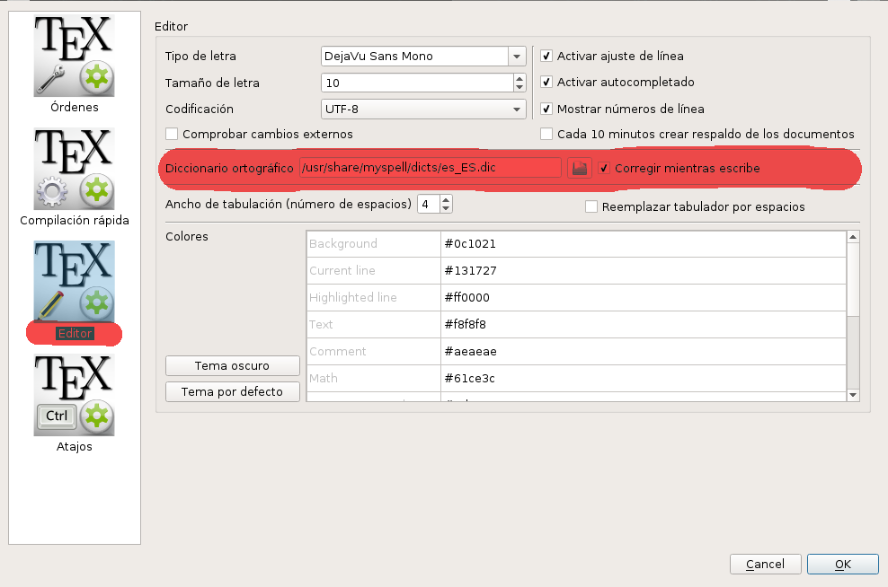
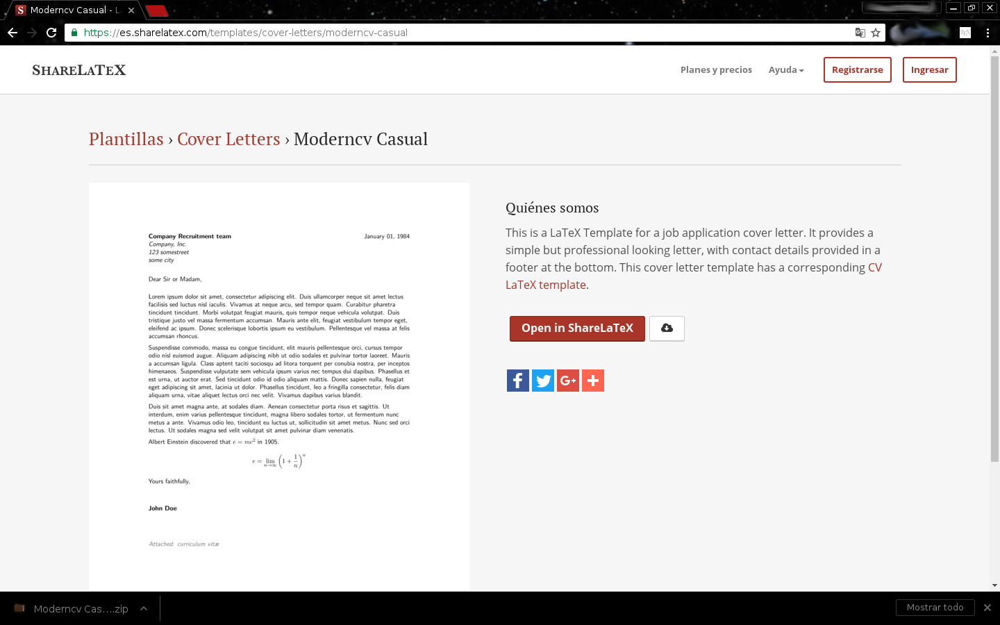

# LaTeX Para Todo

[LaTeX][1] es un editor de textos de alta calidad que incluye características diseñadas para la producción técnica de documentos científicos. LaTeX es el estándar para la comunicación y publicación de textos científicos. Puesto a disposición bajo los términos de la licencia [LPPL][2], LaTeX es [Software Libre][3].

En esta serie de lecturas les mostraré cómo hacer de LaTeX su editor de texto, presentaciones, posters... incluso un editor gráfico muy preciso, literalmente cómo utilizar LaTeX para todos sus documentos.

## Instalación y Primeros Pasos
En primer lugar aclarar que LaTeX es Software Libre y por tanto no hay ninguna necesidad de lidiar con sistemas operativos privativos, si usted por alguna razón es dependiente de un sistema operativo privativo (windows, mac) no podré ayudarle con detalles específicos relacionados a su sistema, sin embargo, dejo claro también que todo lo aquí publicado es completamente funcional en cualquier instalación de LaTeX y aunque por preferencia trabaje con uno o dos editores específicos, todo ha de funcionar en cualquiera sea el editor de su elección porque LaTeX no depende del editor utilizado y con eso ya he mencionado una de las enormes cualidades y ventajas de utilizar LaTeX como editor de texto: siempre podrá trabajar en sus documentos sin importar que no disponga del mismo sistema operativo o de algún editor en particular (eso sí, tendrá que asegurarse de contar con los paquetes adecuados).

### Instalación
Realmente la instalación es un paso tan simple como elegir el editor con el que quiera trabajar y ya estará listo, yo recomiendo [TexMaker][4] porque se trata de un editor libre, multiplataforma, con muchos asistentes disponibles, visualizador de la estructura del códio, previsualizador en tiempo real de la salida en pdf y un gran número de etceteras los cuales puede conocer en la página oficial del proyecto arriba enladazada, la segunda opción que yo recomiendo es [Texstudio][5] que parece un clon de TexMaker pero con muchos más asistentes, así es que si usted disfruta del código su opción es TexMaker, pero si lo suyo es el *wysiwyg* ya puede instalarse el Texstudio.

``#apt-get install texmaker``

o bien

``#apt-get install texstudio``

Cualquiera de los dos debería encontrarse en su repositorio de aplicaciones por defecto.

Claro que para los extremistas pueden disponer de un completo editor web de LaTeX y así no tener que hacer ninguna instalación en sus máquinas, [ShareLaTeX][6] que además es un repositorio de plantillas LaTeX de todo tipo de documentos, es una brillante alternativa, o si lo suyo es el código puro y duro siempre puede utilizar [GNU Emacs][7], en fin, alternativas de editores hay para cada gusto.

Cualquiera sea el editor de su elección, mantenga presente el conjunto de paquetes **``texlive``**, también disponible en los repositorios. De este conjunto de paquetes hacen parte todas las características avanzadas de LaTeX; ya iremos agregando paquetes y aprendiendo a utilizarlos a medida que avancemos.

### Hola Universo LaTeX
¿Qué otra mejor manera de empezar en ''*El Universo LaTeX*''?. Pues bien, para poder hacerlo bien, lo primero es hacerlo con ortografía. Los diccionarios para corrección ortográfica son una herramienta fundamental así es que empezaremos por instalarnos los diccionarios necesarios.

1. Descargar el diccionario de su preferencia, un buen repositorio de diccionarios es el de [WPS Community][8].
2. Después de tener el diccionario ya descargado tendrá que descomprimirlo y copiar los archivos ``.dic`` y ``.aff`` en ``/usr/share/myspell/dicts``, bien puede copiar la carpeta completa siempre que tenga presente el nombre de ésta para configurar el TexMaker (o cualquiera que sea su editor). De estos dos archivos, el primero es el diccionario propiamente dicho y el segundo es el encargado de resaltar las palabras erróneas.
3. Para configurar su TexMaker (editor) para utilizar el diccionario, en el menú **++O++pciones** elija la opción **Configurar Texmaker** y luego el apartado editor, especifique la dirección de ubicación del diccionario tal como se muestra en la imágen.

Con lo anterior ya podrá disponer de diccionarios en su editor de LaTeX y (por lo menos en el caso de Texmaker) será tan fácil usarlos como utilizar la combinación ``Shift + Ctrl + F7`` para ver las palabras erróneas subrayadas en color rojo.

#### Ahora si a decir "Hola Universo LaTeX"

Algún día llegaremos a construir documentos propios y completamente desde cero, pero esa no es la mejor entrada al universo LaTeX, así es que la manera en que vamos a entrar en el universo LaTeX es a través del uso de plantillas, léase por plantilla un documento pre - formateado en el cual simplemente se modifica el contenido y la forma no es necesario tocarla.

Para empezar, trabajaremos sobre una plantilla para cartas.

Como ya lo mencioné, ShareLaTeX tiene un importante [repositorio de plantillas][9] disponibles para descarga gratuita y la mayoría bajo los términos de licencias libres como la LPPL, CC-By-SA, etc. claro, el repositorio de plantillas de ShareLaTeX no es el único, otro buen repositorio es el de [latextemplates.com][10] aunque al parecer a éste hace un buen tiempo que no le hacen aportes nuevos. También [Overleaf][11] es (además de un editor LaTeX en línea con más funcionalidades en su versión gratuita que ShareLaTeX) un buen repositorio donde encontrar cientos de  plantillas. En fin, en esta oportunidad vamos a utilizar la [plantilla *Moderncv Casual*][12] de ShareLaTeX, esta plantilla puede cargarse en el editor en línea de ShareLaTeX o bien descargarla en un archivo ``.zip``, aquí se seguirá la edición a partir de la versión descargada en zip.

Una vez descargada la plantilla y descomprimido el contenido del archivo zip correspondiente se dispondrá de los archivos de estilo que definen el color y la distribución del contenido (archivos de extensión ``.sty``) y del archivo ``main.tex`` que es la carta propiamente dicha. Como recomendación, es bueno copiar este archivo con un nombre específico para cada carta y así dejar la plantilla original sin modificar y poder entonces utilizarla cada vez que sea necesario.

El idioma original de la plantilla es el inglés por tanto, si va a escribir en español tendrá que hacer algunos ajustes a la plantilla o bien utilizar la versión traducida hecha por este servidor y disponible [aquí para su descarga][13].

Pues muy bien, para empezar es más que suficiente que ya pueda escribir todas sus cartas en LaTeX. Simplemente renombre el archivo main.tex (sin cambiarlo de ubicación), ábralo con el editor de LaTeX de su elección y siga las instrucciónes, la plantilla es completamente auto - explicada. En el caso de estar utilizando Texmaker puede compilar y ver el resultado en pdf simplemente accionando la tecla ``F1``. Tenga presente que no es necesario que abra o modifique todos los demás archivos, por ahora solamente necesita modificar el contenido de la carta en el archivo .tex correspondiente, ya luego aprenderá a revisar y modificar los archivos de estilo.

Mantenga presente también que a través de los comentarios o al twitter @piratax007 puede dejar sus preguntas o sugerencias para las próximas ediciones de estas lecturas dedicadas al universo LaTeX. También en el hashtag #LaTeX4all encontrará cápsulas de LaTeX.

En la próxima aprenderá a crear presentaciones de diapositivas.

Hasta entonces.

Lic. Fausto Mauricio Lagos Suárez
Mg. Ingeniería Computacional y Matemáticas
@piratax007

[1]: https://www.latex-project.org/
[2]: https://www.latex-project.org/lppl.txt
[3]: https://www.gnu.org/philosophy/free-sw.html
[4]: http://www.xm1math.net/texmaker/
[5]: http://www.texstudio.org/
[6]: https://es.sharelatex.com/
[7]: https://www.gnu.org/software/emacs/
[8]: http://wps-community.org/download/dicts
[9]: https://es.sharelatex.com/templates
[10]: http://www.latextemplates.com/
[11]: https://www.overleaf.com/latex/templates/
[12]: https://es.sharelatex.com/templates/cover-letters/moderncv-casual
[13]: https://drive.google.com/file/d/0B3grR36BkHEFZlQwdk1yMkY3VVk/view?usp=sharing
