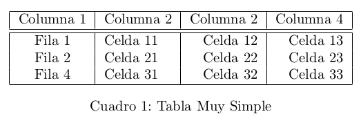
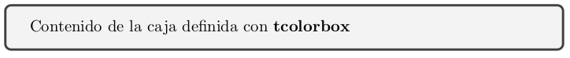
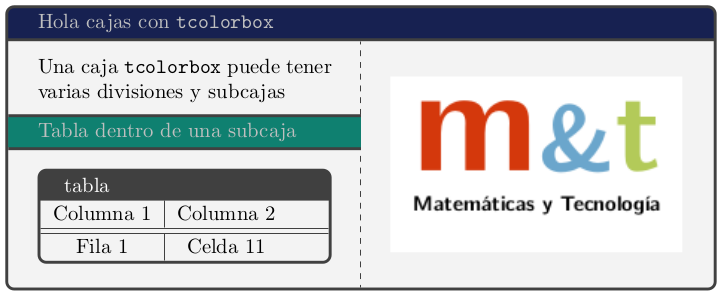

# Tablas o cuadros en LaTeX

Uno de los elementos a menudo presentes en cualquier documento son las tablas o cuadros; son perfectas formas de organizar información y de simplificar la presentación de resultados. Por lo general, queremos que la presentación de nuestras tablas o cuadros no solo sea elegante, sino que dependiendo de la ocasión querremos que además sea llamativa e incluso colorida. LaTeX cuenta con excelentes opciones para una muy lograda presentación de tablas y cuadros y en esta lectura vamos a ver cómo desarrollar uno de estos elementos con más o menos detalle.

En primer lugar, es necesario aclarar que no se establecerá aquí la diferencia entre la definición de cuadro y tabla, debido a que el objetivo no es el contenido sino en la forma, será el usuario / lector quien deberá determinar cómo construir sus tablas / cuadros de acuerdo a la ocasión que se le presente.

## Construir una tabla "simple"

Como siempre, depende del grado de práctica que se quiera adquirir en LaTeX, existen herramientas que brindan la posibilidad de desligarse del trabajo directo con el código para construir las tablas necesarias, entre tales herramientas se cuentan editores en línea de tablas LaTeX como [LaTeX Table Generator][1], [truben.no][2] o también complementos para [LibreOffice][3] ([Writer2LaTeX][4]) que le permitirán, diseñar su tabla en Libreoffice --Writer y exportarla en formato de código LaTeX para insertarla directamente en su documento LaTeX. Hay que tener en cuenta que cualquiera de dichas alternativas permite un nivel de personalización menor al conseguido cuando se trabaja directamente con el código.

Para una introducción paso a paso sobre cómo construir tablas en LaTeX, puede remitirse a [este manual][5] de *Raúl Mata Botana*, esta lectura se enfoca en cómo mejorar la apariencia de nuestras tablas y diseñar tablas un poco más complejas.

Para empezar es necesario mencionar que, como debió darse cuenta en el manual de Raúl Mata Botana, para crear tablas no hace falta cargar ningún paquete adicional; incluir nuevos paquetes dependerá de la apariencia que quiera darle a sus tablas. Para este ejercicio vamos a incluir los paquetes

```
\usepackage{xcolor, colortbl}
\usepackage{array, multirow, multicol}
```
los dos primeros para definir colores y el segundo grupo de paquetes para combinar filas, columnas y celdas.

Empezaremos con una tabla muy básica:

```
\begin{table}[ht]
  \centering
  \begin{tabular}{|c|l|r|r|}
    \hline
    Columna 1 & Columna 2 & Columna 2 & Columna 4 \\
    \hline
    \hline
    Fila 1 & Celda 11 & Celda 12 & Celda 13 \\
    Fila 2 & Celda 21 & Celda 22 & Celda 23 \\
    Fila 4 & Celda 31 & Celda 32 & Celda 33 \\
    \hline
  \end{tabular}
  \caption{Tabla Muy Simple}
\end{table}
```
y el resultado se verá algo así:


A continuación agregaremos algo de color para lo cual es bueno tener a la mano una [paleta de colores RGB definidos en porcentajes][6], agregando en el preámbulo líneas como las siguientes, una por cada color que se quiera definir, dispondrá de todos los colores que necesite (para este ejercicio se utilizarán cuatro colores).

```
\definecolor{skyblue6}{rgb}{.2, .6, .8}
\definecolor{blueice}{rgb}{.85, .96, .94}
\definecolor{firebrick}{rgb}{.7, .13, .13}
\definecolor{lightcopper}{rgb}{.93, .76, .58}
```
ahora, con la instrucción `rowcolor` antepuesta a la línea de código correspondiente a la Fila 2, pintaremos ésta del color definido, esto es

```
\rowcolor{skyblue6}
Fila 2 & Celda 21 & Celda 22 & Celda 23 \\
```
también podemos pintar toda una columna con algún color específico, para ello es necesario que en la definición de la alineación de las celdas en la línea `\begin{tabular}` se aplique el siguiente código en la correspondiente columna

```
|>{\columncolor{blueice}}l|
```
para este ejercicio se ha escogido la segunda columna, luego la mencionada línea queda
```
\begin{tabular}{|c|>{\columncolor{blueice}}l|r|r|}
```

además, para cambiar el color del texto en una celda usamos la instrucción `\textcolor{color}{texto}` donde `color` es el nombre del color definido y `texto` el contenido de la celda.

```
\textcolor{firebrick}{Columna 1} & Columna 2 &
```

por si hiciera falta, asignarle color a una sola celda es tan fácil como incluir la instrucción `\cellcolor{color}{texto}` en la ubicación de la correspondiente celda a colorear, siguiendo el ejemplo, para pintar la Celda 13:

```
Fila 1 & Celda 11 & Celda 12 & \cellcolor{lightcopper}{Celda 13} \\
```

Algo que siempre es útil al construir tablas es poder combinar columnas o filas para ajustar los encabezados respectivos; vamos a empezar por combinar un par de cabeceras de columna para lo cual haremos uso del paquete `multicol` escribiendo el contenido de las celdas combinadas como sigue:

```
\multicolumn{2}{c|}{Columna Combinada} \\
```
el primer parámetro de la instrucción `multicolumn` (`{2}`) es el número de celdas que se van a combinar, el segundo (`{c|}`) es la alineación y el borde y el tercero (`{Columna Combinada}`) el contenido de la celda. Para combinar cabeceras de filas tendremos que agregar en el lugar de la primera celda de la primera fila de la combinación (en este caso, se combinaran la primera celda las filas 3, 4 y 5):

```
\parbox[t]{2mm}{\multirow{3}{*}{\rotatebox[origin=c]{90}{Fila 3}}}
```
luego volveremos sobre la instrucción `\parbox` para estudiarla en detalle.

Para terminar este ejercicio básico, útil si no revisó el manual de Raúl Mata, veremos cómo podemos incluir un párrafo en una celda asignado un ancho fijo a la columna, para ello el entorno tabular, en el argumento de alineación cuenta con las opciones:

```
p{ancho} % columnas con párrafos
m{ancho} % párrafo verticalmente alineado respecto de las columnas adyacentes
b{ancho} % párrafo alineado por la parte inferior
```
también puede combinar filas con la instrucción `\multirow{n}{*}{texto}` donde `n` es le número de filas que desea combinar.

El resultado final de este ejercicio es este:


y el correspondiente código es este

```
\documentclass[10pt,a4paper]{article}
\usepackage[utf8]{inputenc}
\usepackage[spanish]{babel}
\usepackage{amsmath}
\usepackage{amsfonts}
\usepackage{amssymb}
\usepackage{graphicx}
\usepackage{xcolor, colortbl}
\usepackage{lscape}
\usepackage{array, multirow, multicol}

\definecolor{skyblue6}{rgb}{.2, .6, .8}
\definecolor{firebrick}{rgb}{.7, .13, .13}
\definecolor{blueice}{rgb}{.85, .96, .94}
\definecolor{lightcopper}{rgb}{.93, .76, .58}

\begin{document}
	\begin{table}[ht]
		\centering
		\begin{tabular}{|c|>{\columncolor{blueice}}l|c|r|m{4cm}|}
			\hline
			\textcolor{firebrick}{Columna 1} & Columna 2 & \multicolumn{2}{c|}{Columna Combinada} & Columna con P\'arrafo\\
			\hline
			\hline
			Fila 1 & Celda 11 & Celda 12 & \cellcolor{lightcopper}{Celda 13} & Este es un párrafo de muestra en la primera celda de la última columna \\
			\hline
			\rowcolor{skyblue6}
			Fila 2 & Celda 21 & Celda 22 & Celda 23 & Celda P\'arrafo 24 \\
			\hline
			\parbox[t]{2mm}{\multirow{3}{*}{\rotatebox[origin=c]{90}{Fila 3}}} & Celda 31 & \multirow{2}{*}{Celdas Combinadas} & Celda 33 & Celda P\'arrafo 34  \\
			\cline{2-2} \cline{4-5}
			& Celda 41 & & Celda 43 & Celda P\'arrafo 44 \\
			\cline{2-5}
			& Celda 51 & Celda 52 & Celda 53 & Celda P\'arrafo 54  \\
			\hline
		\end{tabular}
		\caption{Tabla simple}
	\end{table}
\end{document}
```

## Construir cuadros más elegantes

Ahora vamos a hacer un ejercicio de construcción de cajas (cuadros) con opciones de diseño y presentación más detalladas que las conseguidas en el ejercicio anterior, para esto se hará uso del paquete `tcolorbox` cuyo manual (en inglés) esta cargado de ejemplos muy claros y puede [descargarse desde aquí][7].

Lo primero es mencionar que el paquete `tcolorbox` puede utilizarse en combinación con la construcción de tablas y que además cuenta con un amplio conjunto de librerías para enriquecer la presentación de las tablas o cuadros que se estén construyendo, aquí solamente se hacerá uso de parte del paquete, lo suficiente para demostrar lo que puede hacerse.

El entorno tcolorbox se inicia con:
```
\begin{tcolorbox}
  Contenido de la caja definida con \textbf{tcolorbox}
\end{tcolorbox}
```
solo con el anterior código se obtiene una caja como la siguiente:



ya en este ejemplo puede verse cómo las esquinas están redondeadas y el grosor de la línea es diferentes y el color de fondo también queda definido por defecto, todos detalles que obviamente pueden ser modificados.

La caja siguiente



corresponde al código mostrado a continuación

```
\documentclass[10pt,a4paper]{article}
\usepackage[utf8]{inputenc}
\usepackage[spanish]{babel}
\usepackage{amsmath}
\usepackage{amsfonts}
\usepackage{amssymb}
\usepackage{graphicx}
\usepackage[table]{xcolor}
\usepackage{colortbl}
\usepackage{array, multirow, multicol, tabularx}
\usepackage{tcolorbox}

\definecolor{bluevelvet}{rgb}{.09, .13, .32}
\definecolor{malachite}{rgb}{.06, .5, .44}

\begin{document}

\begin{tcolorbox}[
	title = Hola cajas con \texttt{tcolorbox},
	coltitle=gray!50,
	colbacktitle=bluevelvet,
	subtitle style = {colback = malachite},
	sidebyside,
	]
	Una caja \texttt{tcolorbox} puede tener varias divisiones y subcajas
  \tcbsubtitle{Tabla dentro de una subcaja}
  	\begin{tcolorbox}[tabularx = {c | c }, title = tabla]
  		Columna 1	&	Columna 2 \\
  		\hline \hline
  		Fila 1 & Celda 11
  	\end{tcolorbox}
  \tcblower
	\includegraphics[scale=1]{images/mit_Logo.png}
\end{tcolorbox}

\end{document}
```

en esta puede verse cómo pueden generarse tablas con varias divisiones e incluso subcajas y también cómo con el paquete `tabularx` pueden diseñarse tablas dentro de cajas tal como en el primer ejercicio de esta lectura.

Lic. Fausto Mauricio Lagos Suárez
Mg. Ingeniería Computacional y Matemática
@BrainOnTube
[youtube.com/c/BrainOnTube][9]

[1]:http://www.tablesgenerator.com/
[2]:http://truben.no/table/
[3]:https://es.libreoffice.org/
[4]:http://extensions.libreoffice.org/extension-center/writer2latex-1
[5]:https://drive.google.com/open?id=0B3grR36BkHEFTy1KMVoxcEpNUlE
[6]: http://www.december.com/html/spec/colorper.html
[7]: http://ctan.uniminuto.edu/macros/latex/contrib/tcolorbox/tcolorbox.pdf
[8]: https://twitter.com/hashtag/LaTeX4all?src=hash
[9]: https://www.youtube.com/c/BrainOnTube
